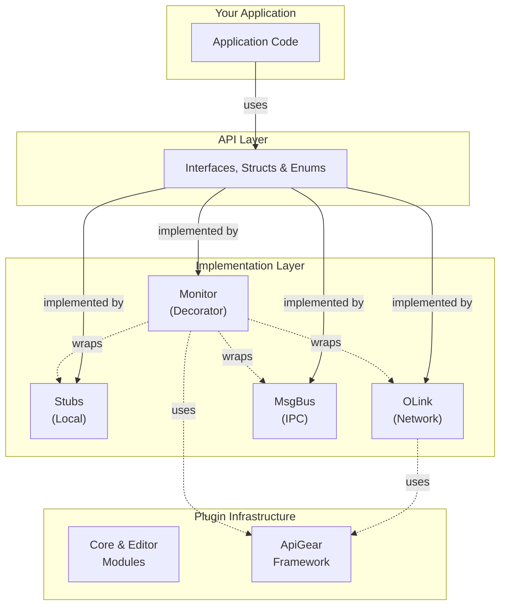

import CodeBlock from '@theme/CodeBlock';
import helloWorldModuleComponent from '!!raw-loader!./data/helloworld.module.yaml';

# Features

This guide explains how to use the generated code, what features are available, and their benefits.

:::info
A feature is a part of the template that generates a specific aspect of the code. For example, the `api` feature generates the core API interfaces and the `stubs` feature generates a stub implementation for the API.
:::

## Get started

This template generates Unreal Engine plugins from your API definitions. The generated code integrates seamlessly with both Blueprints and C++.

:::note
Basic Unreal Engine knowledge is recommended. Familiarity with Unreal's plugin system, Blueprints, and C++ module structure will help you get the most out of the generated code.
:::

### Code generation

Follow the documentation for [code generation](/docs/guide/quick-start) in general and [CLI](/docs/cli/generate) or the [Studio](/docs/studio/intro) tools.
Or try first the [quick start guide](../quickstart/index.md) which shows how to prepare an API and generate code from it.

:::tip
For questions regarding the template please go to our [discussions page](https://github.com/orgs/apigear-io/discussions). For feature requests or bug reports please use our [issue tracker](https://github.com/apigear-io/template-unreal/issues).
:::

### Example API

The following code snippet contains the _API_ definition which is used throughout this guide to demonstrate the generated code and its usage.

<details>
    <summary>Hello World API (click to expand)</summary>
    <CodeBlock language="yaml" showLineNumbers>{helloWorldModuleComponent}</CodeBlock>
</details>

## Features

The template provides features across three layers: **Core** (API and implementations), **Extended** (connectivity and monitoring), and **Infrastructure** (plugin support). These features compose to create a complete plugin architecture:



*Your application programs against the generated API interfaces. Stubs provide local implementations, OLink and MsgBus connect to remote services, Monitor wraps any implementation for tracing, and the Infrastructure layer provides settings and connection management.*

### Core Features

Core features generate Unreal Engine plugins from your API definition:

- [api](api.md) - generates the core interfaces, data types (structs, enums), and abstract base classes. Provides both Blueprint-compatible interfaces and native C++ access.
- [stubs](stubs.md) - generates ready-to-use implementation stubs as GameInstance Subsystems. Provides a starting point for your business logic and test fixtures for unit testing.

### Extended Features

Extended features add connectivity and monitoring capabilities:

- [olink](olink.md) - provides client and server adapters for the [ObjectLink](/docs/protocols/objectlink/intro) protocol. Use this to connect your Unreal application to remote services or the ApiGear simulation tools.
- [msgbus](msgbus.md) - provides adapters using Unreal's built-in Message Bus for inter-process communication within the Unreal ecosystem.

> **Choosing between OLink and Message Bus?** See the [comparison guide](msgbus.md#when-to-use-message-bus-vs-olink) for a detailed breakdown.

- [monitor](monitor.md) - generates a middleware layer which logs all API events to the [CLI](/docs/cli/intro) or the [Studio](/docs/studio/intro).

### Test Features

- `olink_tests` - test fixtures and specs for OLink client/server functionality.
- `msgbus_tests` - test fixtures and specs for Message Bus adapters.

### Internal Features

These features are generated automatically when required by other features:

- `plugin` - generates the `{Module}Core` and `{Module}Editor` modules:
  - **Core module** (`IoWorldCore`): Settings class, implementation factory, and test utilities
  - **Editor module** (`IoWorldEditor`): Project Settings UI customization
- `apigear` - core ApiGear plugin with connection management, settings, and editor UI
- `apigear_olink` - OLink protocol support with client/host connections
- `apigear_olinkproto` - ObjectLink protocol library

**Module Settings**: When you enable extended features, the Core module's settings class (`UIoWorldSettings`) gains configuration options accessible in Project Settings:

| Setting | Feature | Purpose |
|---------|---------|---------|
| `TracerServiceIdentifier` | monitor | Select which backend implementation the monitor traces |
| `OLinkConnectionIdentifier` | olink | Select which OLink connection the client uses |
| `MsgBusHeartbeatIntervalMS` | msgbus | Configure heartbeat interval for service discovery |

**Test Utilities**: The Core module includes test helpers for writing your own automation tests:

```cpp
#include "IoWorld/Tests/IoWorldTestsCommon.h"

FIoWorldMessage TestMsg = createTestFIoWorldMessage();
TArray<FIoWorldMessage> TestArray = createTestFIoWorldMessageArray();
```

Each feature can be selected using the solution file or via the command line tool.

:::note
_Features are case sensitive, make sure to always **use lower-case.**_
:::

:::tip
The _meta_ feature `all` enables all specified features of the template. If you want to see the full extent of the generated code, `all` is the easiest solution.
:::

## Folder structure

This graph shows the folder structure generated for a module with all features enabled. Each ApiGear module becomes an Unreal plugin.

```bash
📂ue_project/Plugins
 ┣ 📂ApiGear
 ┃ ┣ 📜apigear.uplugin
 ┃ ┗ 📂Source
 ┃   ┣ 📂ApiGear
 ┃   ┣ 📂ApiGearEditor
 ┃   ┣ 📂ApiGearOLink
 ┃   ┗ 📂ThirdParty
 ┃     ┣ 📂nlohmannJsonLibrary
 ┃     ┗ 📂OLinkProtocolLibrary
 ┣ 📂IoWorld
 ┃ ┣ 📜IoWorld.uplugin
 ┃ ┣ 📂Config
 ┃ ┗ 📂Source
 ┃   ┣ 📂IoWorldAPI
 ┃   ┣ 📂IoWorldCore
 ┃   ┣ 📂IoWorldEditor
 ┃   ┣ 📂IoWorldImplementation
 ┃   ┣ 📂IoWorldMonitor
 ┃   ┣ 📂IoWorldMsgBus
 ┃   ┗ 📂IoWorldOLink
```

:::note
The module name `io.world` is converted to PascalCase `IoWorld` for Unreal naming conventions. Each feature generates a separate Unreal module within the plugin.
:::
