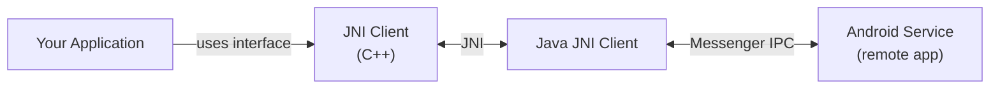
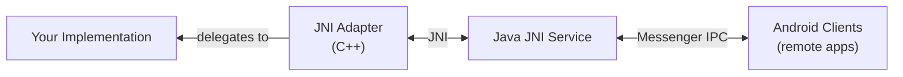
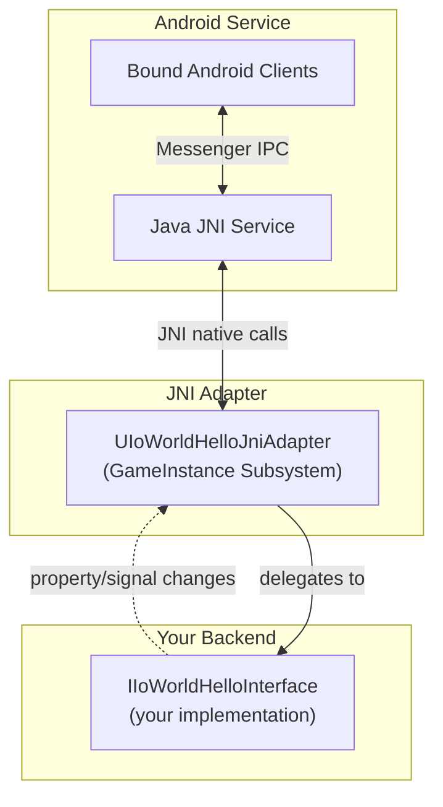
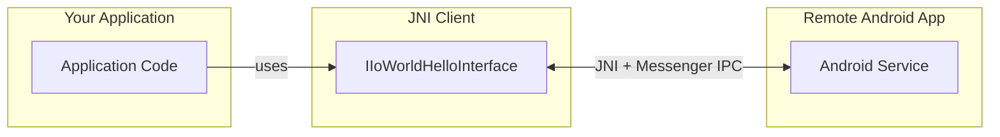

import CodeBlock from '@theme/CodeBlock';
import helloWorldModuleComponent from '!!raw-loader!./data/helloworld.module.yaml';

# JNI

The `jni` feature provides adapter and client components for Android service communication via JNI. This enables:

- **Expose your Unreal implementation** as an Android service that other Android apps can bind to
- **Consume Android services** from your Unreal application
- **Bridge between Unreal Engine C++ and Android Java** using the Messenger IPC protocol

Use a _JNI client_ to connect your Unreal application to an Android service. Use a _JNI adapter_ to expose your local implementation as an Android service.

:::tip
The primary use case is the **client side**. Unreal Engine applications typically act as rendering frontends, consuming data from native Android services that own and share the data. The adapter side is available for cases where the Unreal application needs to expose its implementation to other Android apps.
:::

:::note
The JNI feature requires the **template-java** `jnibridge` feature to generate the Java-side JNI bridge code. Both templates must target the same API definition.
:::

:::caution
The JNI feature requires your Unreal Engine project to be set up for Android development. If you haven't done this yet, follow the [Unreal Engine Android setup guide](https://dev.epicgames.com/documentation/en-us/unreal-engine/setting-up-unreal-engine-projects-for-android-development) before proceeding.
:::

## Architecture

The JNI feature connects Unreal Engine to Android through two generated layers. Template-java generates the Java side, which manages Android service lifecycle and Messenger IPC. This template generates the C++ side, which provides the JNI bindings Unreal Engine uses to communicate with that Java layer.

**Client path** (Unreal app consumes an Android service):



**Adapter path** (Unreal app exposes an Android service):



*You typically use only one side per application. See the tip above for guidance on which side to use.*

On the Android side, cross-process communication follows the [Messenger](https://developer.android.com/reference/android/os/Messenger) bound-service pattern. The JNI layer translates between C++ and Java; Messenger handles the actual IPC between applications. For details on the Java-side implementation, refer to the [template-java](/template-java/docs/intro) documentation.

## Prerequisites

### Solution File Setup

Your solution file must include both the Unreal and Java template layers targeting the same API:

```yaml
schema: "apigear.solution/1.0"
name: helloworld
version: "0.1.0"

layers:
  - name: unreal
    inputs:
      - helloworld.module.yaml
    output: ../YourProject/Plugins
    template: apigear-io/template-unreal
    features: [api, stubs, jni, plugin]
  - name: java
    inputs:
      - helloworld.module.yaml
    output: ../YourProject/android
    template: apigear-io/template-java
    features: [api, android, stubs, jnibridge]
```

The Java modules must be output to an `android/` directory next to the `Plugins/` directory. The Unreal build system compiles them together with the JNI module.

### Platform Requirements

- Android SDK version 33 or higher
- Unreal Engine 5.5 or later
- Android NDK (provided by UE Android setup)

## File overview for module

With our example API definition:

<details>
  <summary>Hello World API (click to expand)</summary>
  <CodeBlock language="yaml" showLineNumbers>{helloWorldModuleComponent}</CodeBlock>
</details>

The following file structure is generated:

```bash
📂IoWorld/Source/IoWorldJni
 ┣ 📂Public/IoWorld
 ┃ ┣ 📜IoWorldJni.h
 ┃ ┗ 📂Generated/Jni
 ┃   ┣ 📜IoWorldHelloJniAdapter.h
 ┃   ┣ 📜IoWorldHelloJniClient.h
 ┃   ┣ 📜IoWorldDataJavaConverter.h
 ┃   ┗ 📜IoWorldJniConnectionStatus.h
 ┣ 📂Private/Generated
 ┃ ┣ 📂Detail
 ┃ ┣ 📂Jni
 ┃ ┃ ┣ 📜IoWorldHelloJniAdapter.cpp
 ┃ ┃ ┣ 📜IoWorldHelloJniClient.cpp
 ┃ ┃ ┗ 📜IoWorldDataJavaConverter.cpp
 ┃ ┗ 📜IoWorldJni.cpp
 ┣ 📜IoWorldJni.Build.cs
 ┗ 📜IoWorld_JNI_UPL.xml
```

The `IoWorld_JNI_UPL.xml` is an Unreal Plugin Language file that configures Android manifest entries, permissions, and Java source inclusion for the build.

## JNI Adapter (Service Side)

The `UIoWorldHelloJniAdapter` exposes a local `IIoWorldHelloInterface` implementation as an Android service. Other Android applications can bind to this service via Android's [Messenger](https://developer.android.com/reference/android/os/Messenger) IPC mechanism.

Each interface declared in your `*.module.yaml` produces a separate Android service. All services run on the application thread — no extra threads are spawned per service.

### How It Works

1. **Wraps local implementation**: Takes an existing implementation (e.g., your stub) via `setBackendService()`
2. **Creates Android service**: On initialization, starts a Java Android service with the JNI adapter as its native backend
3. **Forwards changes**: Property changes and signals from the C++ implementation are forwarded to bound Java clients via JNI callbacks
4. **Handles remote requests**: Incoming requests from Java clients are forwarded to the wrapped implementation



*The adapter wraps any `IIoWorldHelloInterface` implementation and exposes it as an Android service. Multiple Android clients can bind simultaneously.*

### Thread Safety

The adapter marshals all incoming JNI calls to the **game thread**, so your backend implementation never receives calls from the JNI thread directly.

### Delegates

| Delegate | Description |
|----------|-------------|
| `_JniServiceStarted` | Fires when the Android service has fully started |
| `_JniServiceDied` | Fires when the Android service dies unexpectedly |

Both delegates have Blueprint-assignable variants (`_JniServiceStartedBP`, `_JniServiceDiedBP`).

### Using the JNI Adapter

```cpp
#include "IoWorld/Generated/Jni/IoWorldHelloJniAdapter.h"
#include "IoWorld/Implementation/IoWorldHello.h"

// Get your local implementation (GameInstance subsystem)
UIoWorldHelloImplementation* LocalHello = GetGameInstance()->GetSubsystem<UIoWorldHelloImplementation>();

// Get the JNI adapter (GameInstance subsystem)
UIoWorldHelloJniAdapter* Adapter = GetGameInstance()->GetSubsystem<UIoWorldHelloJniAdapter>();

// Connect the adapter to your implementation
Adapter->setBackendService(LocalHello);

// Monitor service lifecycle
Adapter->_JniServiceStarted.AddLambda([]() {
    UE_LOG(LogTemp, Log, TEXT("Android service started - clients can now bind"));
});

Adapter->_JniServiceDied.AddLambda([]() {
    UE_LOG(LogTemp, Warning, TEXT("Android service died unexpectedly"));
});
```

The adapter initializes the Android service automatically. The `_JniServiceStarted` delegate fires asynchronously on the game thread once the Java-side Android service has fully started. Once it fires, remote Android clients can bind to the service.

## JNI Client

The `UIoWorldHelloJniClient` connects to a remote Android service and implements `IIoWorldHelloInterface`. It can be used interchangeably with stubs, OLink clients, or any other implementation.

### How It Works

1. **Bind to service**: Call `_bindToService()` with the target application's package name
2. **Use the interface**: Properties, operations, and signals work transparently through JNI
3. **Async operations**: Operations return `TFuture` for non-blocking execution



*The client acts as a **remote proxy** — it implements the same interface as a local implementation but communicates with an Android service via JNI and Messenger IPC.*

### Connection Management

```cpp
#include "IoWorld/Generated/Jni/IoWorldHelloJniClient.h"

// Get the JNI client (GameInstance subsystem)
UIoWorldHelloJniClient* HelloClient = GetGameInstance()->GetSubsystem<UIoWorldHelloJniClient>();

// Bind to the service exposed by another Android app
// servicePackage: the Android package name of the app hosting the service
// connectionId: a unique identifier for this connection
bool bBound = HelloClient->_bindToService(TEXT("com.example.myservice"), TEXT("connection1"));

// Check connection state
if (HelloClient->_IsReady())
{
    // Client is connected and ready
}

// React to connection changes
HelloClient->_ConnectionStatusChanged.AddLambda([](bool bConnected) {
    UE_LOG(LogTemp, Log, TEXT("JNI connection: %s"), bConnected ? TEXT("ready") : TEXT("disconnected"));
});
```

:::caution
The JNI client does not automatically start the remote service. The service must already be running before `_bindToService()` is called. Automatic reconnection is not provided — if the service dies, you must call `_bindToService()` again.
:::

### Properties

Properties are synchronized from the remote service. When the service-side implementation changes a property, the client receives the update via JNI callback:

```cpp
// Getter returns the current value (updated from remote service)
FIoWorldMessage UIoWorldHelloJniClient::GetLast() const;

// Setter sends a change request to the remote service
void UIoWorldHelloJniClient::SetLast(const FIoWorldMessage& InLast);
```

### Operations

Operations support both synchronous and asynchronous variants:

```cpp
// Synchronous (blocks until the remote service responds)
int32 Result = HelloClient->Say(Msg, EIoWorldWhen::IWW_Now);

// Asynchronous (returns immediately)
HelloClient->SayAsync(Msg, EIoWorldWhen::IWW_Now).Then([](TFuture<int32> Future) {
    int32 Result = Future.Get();
    // Handle result
});
```

:::caution
Synchronous calls block the calling thread while waiting for the remote service to respond. This includes JNI calls, Messenger IPC, and the service-side processing. **Prefer async variants to avoid blocking the game thread.**
:::

### Signals

Signals from the remote service are broadcast to local subscribers via the Publisher:

```cpp
HelloClient->_GetPublisher()->OnJustSaidSignalBP.AddDynamic(this, &UMyClass::OnJustSaid);
```

### Blueprint Usage

The `_bindToService()` and `_unbind()` functions are Blueprint-callable. Connection status can be monitored via the `_ConnectionStatusChangedBP` delegate. Use the client through the `IIoWorldHelloInterface` like any other implementation.

## Data Conversion

The `IoWorldDataJavaConverter` class handles automatic conversion between C++ and Java types across the JNI boundary.

### Automatic Conversion

Structs, enums, arrays, and primitive types are converted automatically. No user action is required for these types.

### Manual Conversion Required

- **Extern types**: Since ApiGear has no knowledge of extern type structure, automatic conversion is impossible. Only skeleton functions are generated — you **must** provide the conversion logic yourself in `IoWorldDataJavaConverter.cpp`:
  - `fillYourExternName()` — converts from Java object to C++ type
  - `makeJavaYourExternName()` — converts from C++ type to Java object

## Android Project Configuration

The minimum target SDK version must be **33 or higher**, as required by the template-java side.

When providing the service side, set the `PackageName` in your Android project settings — clients must specify this package name in `_bindToService()` to connect to your service.

The `IoWorld_JNI_UPL.xml` file automatically configures the Android manifest with service declarations and query entries needed for service binding.

## Testing

The `jni_tests` feature generates test fixtures for JNI functionality:

```bash
📂IoWorld/Source/IoWorldJni/Private/Tests
 ┣ 📜IoWorldHelloJni.spec.cpp
 ┣ 📜IoWorldHelloJniFixture.h
 ┗ 📜IoWorldHelloJniFixture.cpp
```

These tests verify adapter and client functionality including property synchronization, operation invocation, and signal propagation. They require an Android device or emulator to run.

### Running Tests

Install and launch your Unreal application on the target Android device. Once the application is running, trigger the tests via an adb broadcast:

```bash
adb shell am broadcast -a android.intent.action.RUN --es cmd '"Automation RunTests <ModuleName>"'
```

Replace `<ModuleName>` with your ApiGear module name in PascalCase (e.g., `IoWorld` for the `io.world` module). This runs all JNI tests for that module.

Monitor test results using `adb logcat` — look for `LogAutomationController` entries.

## Best Practices

### Async Operations

Prefer async operation variants to avoid blocking the game thread across the JNI and IPC boundary. See [Operations](#operations) for usage examples.

If an async operation fails on the service side, the `TPromise` is fulfilled with a default-constructed value and a warning is logged. This prevents deadlocks from unfulfilled promises but means the caller cannot distinguish a failure from a legitimate default return value. Check logs if you suspect silent failures.

### Service Lifecycle

- The client does not auto-reconnect — call `_bindToService()` again after the remote service restarts
- Subscribe to `_ConnectionStatusChanged` (client) and `_JniServiceDied` (adapter) to detect disconnections and trigger recovery
- On the adapter side, if `_JniServiceDied` fires, re-initialize the adapter by calling `setBackendService()` again to restart the Android service

### Performance Considerations

- JNI calls involve serialization, JNI boundary crossing, and Messenger IPC — avoid calling them every frame
- Use property change delegates for reactive updates instead of polling getters
- Consider enabling monitor tracing only for specific interfaces, as it adds overhead on top of JNI

### Package Name Coordination

- Both sides must agree on the Android package name for service binding
- The client passes this name to `_bindToService()`; the adapter's app must be installed with that exact package name
- Document the package name in your solution file or a shared project configuration to avoid mismatches

### Extern Type Converters

- Implement extern type converters in `IoWorldDataJavaConverter.cpp` early in development
- Unimplemented converter skeletons compile but silently return default-constructed values at runtime
- The generated `makeJava*` functions assume the extern Java class has a no-argument constructor — if it does not, a `NoSuchMethodError` occurs at runtime
- Ensure the extern type's Java class is loadable by the default class loader; classes from third-party libraries may require additional packaging configuration

### Interface Role Separation

- Each application should use either the adapter or the client for a given interface, not both
- The adapter exposes a local implementation as a service; the client consumes a remote one
- Using both in the same app for the same interface creates an unnecessary round-trip through Messenger IPC back to itself
