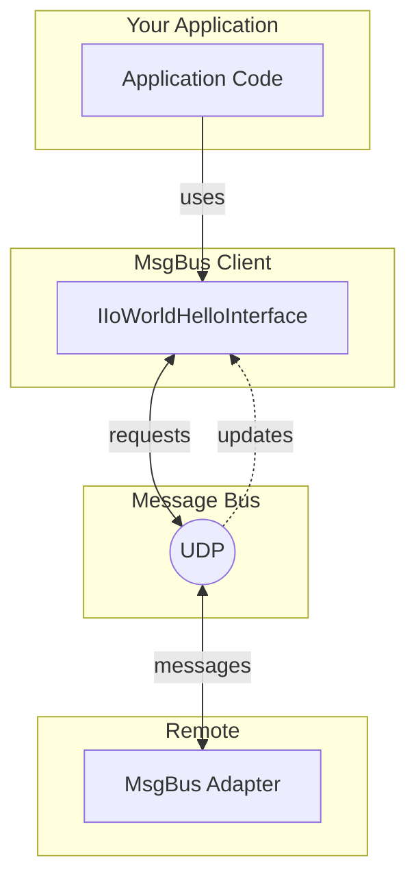
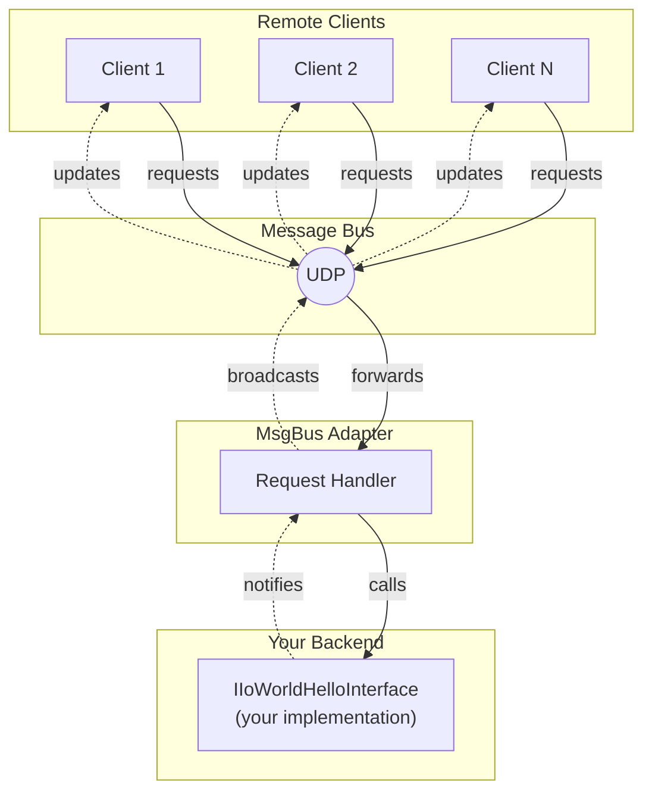
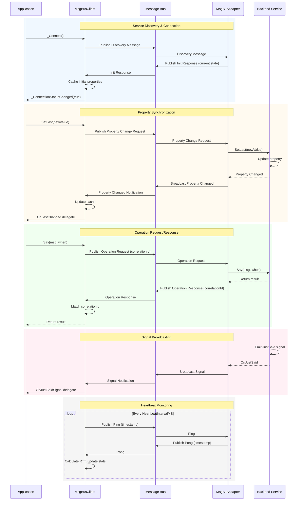

import CodeBlock from '@theme/CodeBlock';
import helloWorldModuleComponent from '!!raw-loader!./data/helloworld.module.yaml';

# Message Bus

The `msgbus` feature provides client and adapter implementations using Unreal Engine's built-in [Message Bus](https://dev.epicgames.com/documentation/en-us/unreal-engine/API/Runtime/Messaging/IMessageBus) system. This enables:

- **Inter-process communication**: Connect Unreal applications running on the same machine
- **Editor-to-game communication**: Share data between editor tools and PIE sessions
- **Distributed Unreal systems**: Connect multiple Unreal instances in a local network

Unlike [OLink](olink.md), which uses WebSockets, Message Bus uses Unreal's native UDP-based messaging system optimized for Unreal-to-Unreal communication.

## When to use Message Bus vs OLink

| Feature | Message Bus | OLink |
|---------|-------------|-------|
| Protocol | Unreal's UDP Message Bus | WebSocket |
| Best for | Unreal-to-Unreal communication | Cross-platform, simulation |
| Setup | Zero configuration on localhost | Requires URL configuration |
| Network | Local network / same machine | Any network |
| ApiGear Simulation | No | Yes |
| Non-Unreal clients | No | Yes |

:::tip
Use **Message Bus** when communicating between Unreal applications.
Use **OLink** when connecting to non-Unreal services or ApiGear simulation tools.
:::

## File overview for module

With our example API definition:

<details>
  <summary>Hello World API (click to expand)</summary>
  <CodeBlock language="yaml" showLineNumbers>{helloWorldModuleComponent}</CodeBlock>
</details>

The following file structure is generated in the `IoWorldMsgBus` module:

```bash
📂IoWorld/Source/IoWorldMsgBus
 ┣ 📂Private
 ┃ ┣ 📂Generated
 ┃ ┃ ┣ 📜IoWorldMsgBus.cpp
 ┃ ┃ ┗ 📂MsgBus
 ┃ ┃   ┣ 📜IoWorldHelloMsgBusClient.cpp
 ┃ ┃   ┗ 📜IoWorldHelloMsgBusAdapter.cpp
 ┃ ┗ 📂Tests
 ┃   ┣ 📜IoWorldHelloMsgBus.spec.cpp
 ┃   ┣ 📜IoWorldHelloMsgBusFixture.h
 ┃   ┗ 📜IoWorldHelloMsgBusFixture.cpp
 ┣ 📂Public
 ┃ ┗ 📂IoWorld
 ┃   ┣ 📜IoWorldMsgBus.h
 ┃   ┗ 📂Generated/MsgBus
 ┃     ┣ 📜IoWorldHelloMsgBusClient.h
 ┃     ┣ 📜IoWorldHelloMsgBusAdapter.h
 ┃     ┗ 📜IoWorldHelloMsgBusMessages.h
 ┗ 📜IoWorldMsgBus.Build.cs
```

## Message Bus Client

The `UIoWorldHelloMsgBusClient` class implements `IIoWorldHelloInterface` and communicates with a remote adapter via Message Bus.

### How it works

1. **Discovers service**: Publishes a discovery message to locate the adapter on the network
2. **Subscribes to messages**: Listens for property changes, signals, and operation replies from the adapter
3. **Publishes requests**: Sends property change requests and operation calls
4. **Caches state**: Maintains local copies of properties synchronized from the adapter
5. **Monitors health**: Tracks connection status with heartbeat ping/pong



*The client acts as a **Remote Proxy** - it implements the same interface as the backend service but forwards calls over Message Bus. Properties are cached locally for fast reads.*

### Connection Management

The client provides methods to manage the connection lifecycle:

```cpp
UFUNCTION(BlueprintCallable, Category = "ApiGear|IoWorld|Hello|Remote")
void _Connect();

UFUNCTION(BlueprintCallable, Category = "ApiGear|IoWorld|Hello|Remote")
void _Disconnect();

UFUNCTION(BlueprintCallable, Category = "ApiGear|IoWorld|Hello|Remote")
bool _IsConnected() const;
```

The client automatically discovers the adapter service using Unreal's Message Bus. The endpoint is registered with the address `"ApiGear/IoWorld/Hello/Client"`.

### Connection Status

The client broadcasts connection status changes through delegates:

```cpp
UPROPERTY(BlueprintAssignable, Category = "ApiGear|IoWorld|Hello|Remote", DisplayName = "Connection Status Changed")
FIoWorldHelloConnectionStatusChangedDelegateBP _ConnectionStatusChangedBP;
FIoWorldHelloConnectionStatusChangedDelegate _ConnectionStatusChanged;
```

### Statistics and Health Monitoring

The client tracks round-trip time statistics (current, average, min, max RTT in milliseconds) through `FIoWorldHelloStats`. Access statistics and subscribe to updates:

```cpp
const FIoWorldHelloStats& Stats = HelloClient->_GetStats();

HelloClient->_StatsUpdated.AddDynamic(this, &UMyClass::OnStatsUpdated);
```

### API Implementation

The client implements the standard `IIoWorldHelloInterface` (see [API documentation](api.md)):

- **Properties**: Getters return locally cached values synchronized from the adapter. Setters send change requests to the adapter. The implementation optimizes network load by only sending when values actually change.
- **Operations**: Calls are sent to the adapter and block until a response is received. Returns a default value if not connected.
- **Signals**: Subscribe to signals through the Publisher, which broadcasts events received from the adapter.

### Using the Client

```cpp
#include "IoWorld/Generated/MsgBus/IoWorldHelloMsgBusClient.h"

UIoWorldHelloMsgBusClient* HelloClient = GetGameInstance()->GetSubsystem<UIoWorldHelloMsgBusClient>();

HelloClient->_Connect();

HelloClient->_ConnectionStatusChangedBP.AddDynamic(this, &UMyClass::OnConnectionStatusChanged);

TScriptInterface<IIoWorldHelloInterface> Hello = HelloClient;
Hello->Say(Msg, EIoWorldWhen::IWW_Now);

Hello->_GetPublisher()->OnLastChangedBP.AddDynamic(this, &UMyClass::OnLastChanged);
```

## Message Bus Adapter

The `UIoWorldHelloMsgBusAdapter` wraps a local `IIoWorldHelloInterface` implementation and exposes it via Message Bus.

### How it works

1. **Wraps local implementation**: Uses an existing implementation (e.g., your stub)
2. **Handles discovery**: Responds to client discovery messages and initializes connections
3. **Handles requests**: Processes property change requests and operation calls from clients
4. **Broadcasts updates**: Publishes property changes and signals to all subscribed clients
5. **Tracks clients**: Monitors connected clients and handles timeouts



*The adapter uses the **Adapter Pattern** - it wraps any `IIoWorldHelloInterface` implementation and exposes it over Message Bus. Multiple clients can connect simultaneously.*

### Connection Management

The adapter provides methods to control when it accepts client connections:

```cpp
UFUNCTION(BlueprintCallable, Category = "ApiGear|IoWorld|Hello|Remote")
void _StartListening();

UFUNCTION(BlueprintCallable, Category = "ApiGear|IoWorld|Hello|Remote")
void _StopListening();

UFUNCTION(BlueprintCallable, Category = "ApiGear|IoWorld|Hello|Remote")
bool _IsListening() const;
```

### Client Tracking

The adapter provides delegates to monitor client connections:

```cpp
UPROPERTY(BlueprintAssignable, Category = "ApiGear|IoWorld|Hello|Remote", DisplayName = "New client connected")
FIoWorldHelloClientConnectedDelegate _OnClientConnected;

UPROPERTY(BlueprintAssignable, Category = "ApiGear|IoWorld|Hello|Remote", DisplayName = "Client disconnected")
FIoWorldHelloClientDisconnectedDelegate _OnClientDisconnected;

UPROPERTY(BlueprintAssignable, Category = "ApiGear|IoWorld|Hello|Remote", DisplayName = "Client timed out")
FIoWorldHelloClientTimeoutDelegate _OnClientTimeout;

UPROPERTY(BlueprintAssignable, Category = "ApiGear|IoWorld|Hello|Remote", DisplayName = "Clients connected count changed")
FIoWorldHelloClientCountDelegate _OnClientsConnectedCountChanged;

UFUNCTION(BlueprintCallable, Category = "ApiGear|IoWorld|Hello|Remote")
const int32 _GetClientsConnectedCount() const;
```

### Backend Service

The adapter wraps an existing implementation that handles the actual business logic:

```cpp
UFUNCTION(BlueprintCallable, Category = "ApiGear|IoWorld|Hello")
void _setBackendService(TScriptInterface<IIoWorldHelloInterface> InService);
```

### Using the Adapter

```cpp
#include "IoWorld/Generated/MsgBus/IoWorldHelloMsgBusAdapter.h"
#include "IoWorld/Implementation/IoWorldHello.h"

UIoWorldHelloImplementation* LocalHello = GetGameInstance()->GetSubsystem<UIoWorldHelloImplementation>();

UIoWorldHelloMsgBusAdapter* Adapter = GetGameInstance()->GetSubsystem<UIoWorldHelloMsgBusAdapter>();
Adapter->_setBackendService(LocalHello);
Adapter->_StartListening();

Adapter->_OnClientConnected.AddDynamic(this, &UMyClass::OnClientConnected);
Adapter->_OnClientDisconnected.AddDynamic(this, &UMyClass::OnClientDisconnected);
```

## Testing with Message Bus

The `msgbus_tests` feature generates test fixtures:

```bash
IoWorld/Source/IoWorldMsgBus/Private/Tests
 ├── IoWorldHelloMsgBus.spec.cpp
 ├── IoWorldHelloMsgBusFixture.h
 └── IoWorldHelloMsgBusFixture.cpp
```

### Running Tests

```bash
UnrealEditor-Cmd.exe YourProject.uproject -ExecCmds="Automation RunTests IoWorld.MsgBus"
```

## Best Practices

### Lifecycle Management

- Initialize adapters before clients start connecting
- Clean up adapters when no longer needed to stop message handling
- Clients should handle adapter unavailability gracefully
- Monitor connection status changes to react to disconnections

### Performance

- Message Bus is efficient for moderate message rates
- For high-frequency updates, consider using direct connections
- Property changes are only broadcast when values actually change
- The client tracks sent values to avoid redundant network requests

## Message Protocol

The Message Bus feature uses generated message structures (`IoWorldHelloMsgBusMessages.h`) for communication between client and adapter. These messages handle:

- **Connection lifecycle** - service discovery, initialization, and disconnect
- **Heartbeat monitoring** - ping/pong messages to detect connection health
- **Property synchronization** - change requests and notifications
- **Operation request/response** - calls with correlation IDs for matching replies
- **Signal broadcasting** - events sent to all connected clients

:::note
You don't need to interact with these message types directly - they are used internally by the client and adapter classes.
:::

### Communication Flow

The following diagram shows how messages flow between client and adapter for each type of interaction:

